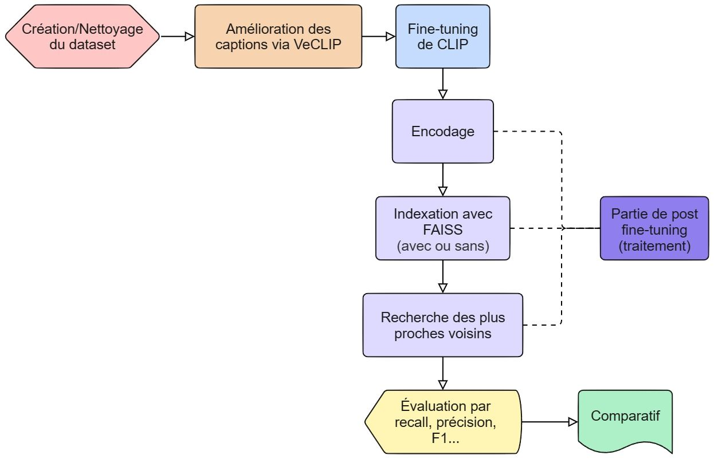
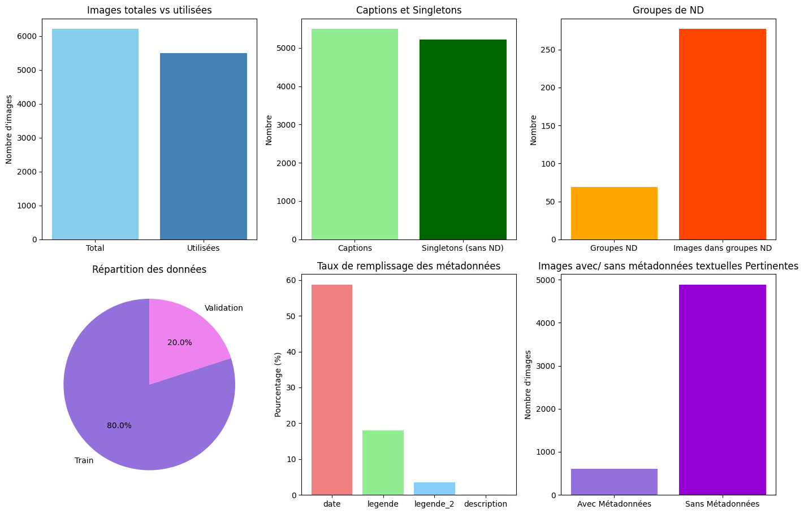
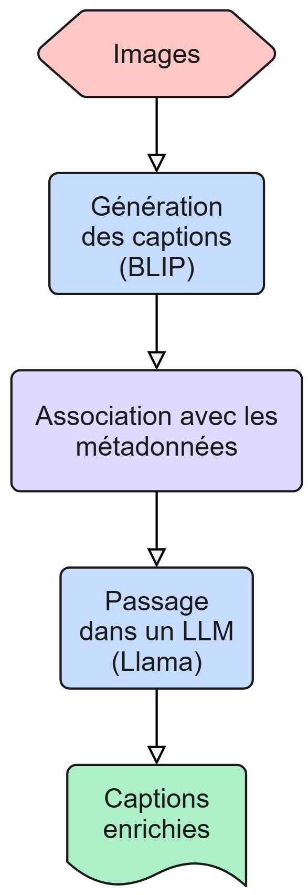
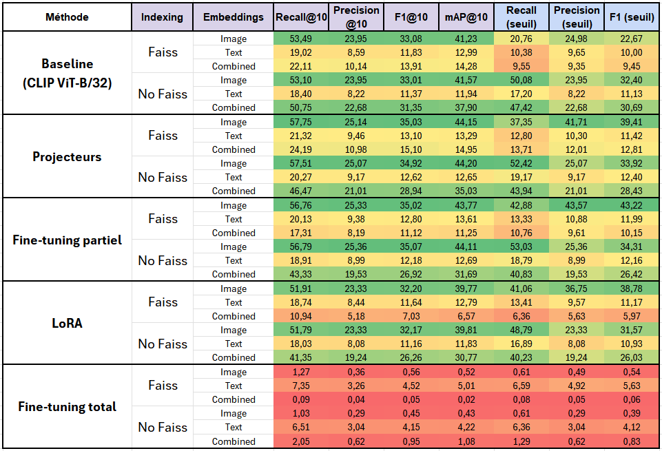
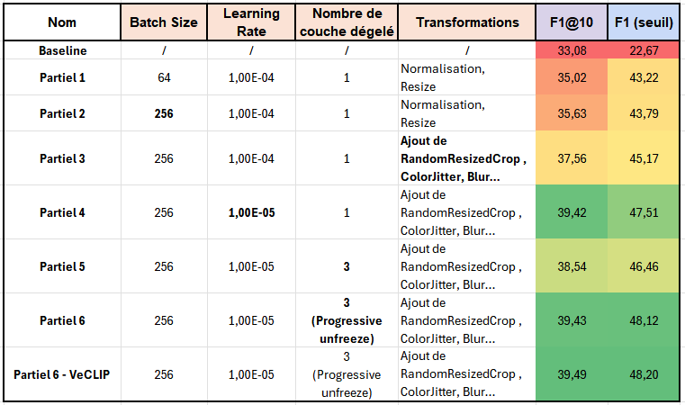

# Détection de Near-Duplicates dans une Base d’Images Historiques avec CLIP

Projet de détection de *near-duplicates* dans une base d’images historiques à l’aide de CLIP fine-tuné.

## Objectif

Ce projet vise à détecter automatiquement les *near duplicates* (doublons visuellement très similaires) dans une base d’images historiques. Il repose sur l’utilisation de **CLIP**, un modèle multimodal vision/texte, adapté via un fine-tuning supervisé à partir de couples *image / description (caption)* spécifiques au domaine.

## Installation

1. **Cloner le dépôt**

```
git clone https://github.com/ton-utilisateur/CBIR-Clip-Fine-tuned.git
cd CBIR-Clip-Fine-tuned
````

2. **Créer un environnement virtuel**

```
python -m venv venv
# Sous Windows
venv\Scripts\activate
# Sous MacOS/Linux
source venv/bin/activate
```

3. **Installer les dépendances**

```
pip install -r requirements.txt
```

## Comment exécuter le projet

### Prérequis

- Avoir un dossier contenant :
  - Les **images historiques** (`historicaldataset/`)
  - Le fichier Excel de **vérité terrain** (`lipade_images_similaires.xlsx`)
  - Le fchier csv contenant les **captions** (`captions.csv`)
- Chemins d'accès adaptés aux fichiers sur votre machine.
- Les dépendances Python installées (voir section Installation).

Important : Les données de base ne sont pas fournies dans ce dépôt Git, car la base de données utilisée ne m'appartient pas (contactez Mr. Camille KURTZ si besoin).

### Exécution étape par étape

#### 0. Placez vous dans le dossier des scripts

```
cd Scripts
````

#### 1. Nettoyage du dossier d’images

Le script `dataset_cleaning.py` détecte les images corrompues dans un dossier et les déplace automatiquement dans un sous-dossier à part (`corrupted/`).

##### Syntaxe de base

```
python dataset_cleaning.py --image_folder <chemin>
```

##### Paramètres

| Paramètre        | Obligatoire | Description                                                 |
| ---------------- | ----------- | ----------------------------------------------------------- |
| `--image_folder` | Oui       | Chemin vers le **dossier contenant les images** à analyser. |

##### Exemple

```
python dataset_cleaning.py --image_folder historicaldataset/
```

Ce script créera un dossier `historicaldataset/corrupted/` contenant toutes les images illisibles ou corrompues détectées.

#### 2. Génération des captions enrichies avec VeCLIP

Le script `generate_enrich_captions.py` enrichit automatiquement les captions existantes à l’aide de métadonnées et d’un modèle de langage local (comme Mistral), puis enregistre les résultats dans un fichier JSON.

##### Syntaxe de base

```
python generate_enrich_captions.py --captions <chemin> --metadata <chemin> [--output <chemin>]
```

##### Paramètres

| Paramètre    | Obligatoire | Description                                                                                                        |
| ------------ | ----------- | ------------------------------------------------------------------------------------------------------------------ |
| `--captions` | Oui       | Chemin vers le fichier CSV contenant les **captions existantes** (une ligne par image).                            |
| `--metadata` | Oui       | Chemin vers le fichier CSV contenant les **métadonnées des images** (ex : lieu, date, thème, etc.).                |
| `--output`   | Non       | Chemin du fichier **JSON de sortie** qui contiendra les captions enrichies. Par défaut : `enriched_captions.json`. |

##### Exemple

```
python generate_enrich_captions.py ^
  --captions captions.csv ^
  --metadata metadata.csv ^
  --output enriched_captions.json
```

#### 3. Génération du fichier de vérité terrain structuré

Le script `parse_groundtruth.py` regroupe les informations issues de la vérité terrain (annotations Excel), des descriptions, et éventuellement des captions enrichies VeCLIP. Il produit un fichier JSON contenant la division `train/val/test`, les correspondances entre images, leurs légendes, etc.

##### Syntaxe de base

```
python parse_groundtruth.py --image_folder <chemin> --excel_file <chemin> --csv_descriptions_file <chemin> [options]
```

##### Paramètres

| Paramètre                 | Obligatoire | Description                                                                                                    |
| ------------------------- | ----------- | -------------------------------------------------------------------------------------------------------------- |
| `--image_folder`          | Oui       | Chemin vers le **dossier contenant les images**.                                                               |
| `--excel_file`            | Oui       | Chemin vers le fichier Excel contenant les **groupes d'images similaires** (vérité terrain).                   |
| `--csv_descriptions_file` | Oui       | Chemin vers le fichier CSV contenant les **descriptions d’images** (captions).                                 |
| `--use_veclip_caption`    | Non       | Si activé, remplace les captions classiques par les **captions enrichies de VeCLIP**.                          |
| `--veclip_json_file`      | Non       | Chemin vers le fichier JSON contenant les **captions enrichies**, requis si `--use_veclip_caption` est activé. |
| `--output_json`           | Non       | Chemin du **fichier JSON de sortie** (défaut : `ground_truth.json`).                                           |
| `--test_size`             | Non       | Proportion de données à réserver pour le **jeu de test** parmi les singletons (défaut : `0.2`).                |
| `--seed`                  | Non       | Seed pour garantir la reproductibilité du **split train/val/test**.                                |

##### Exemple

```
python parse_groundtruth.py ^
  --image_folder historicaldataset/ ^
  --excel_file lipade_images_similaires.xlsx ^
  --csv_descriptions_file captions.csv ^
  --use_veclip_caption ^
  --veclip_json_file veclip_json.json ^
  --output_json ground_truth.json ^
  --test_size 0.2 ^
  --seed 2
```

#### 4. Entraînement du modèle CLIP, génération des embeddings, indexation FAISS et évaluation

Le script `main.py` exécute l’ensemble du pipeline de traitement : fine-tuning du modèle CLIP (ou chargement d’un modèle déjà entraîné), génération des embeddings, création d’un index de similarité FAISS, et évaluation avec la vérité terrain.

##### Syntaxe de base

```
python main.py --model_folder <chemin> --image_folder <chemin> --load_method <méthode> [options]
```

##### Paramètres

| Paramètre              | Obligatoire | Description                                                                                        |
| ---------------------- | ----------- | -------------------------------------------------------------------------------------------------- |
| `--model_folder`       | Oui       | Dossier où sauvegarder / charger le modèle (et ses fichiers associés).                             |
| `--image_folder`       | Oui       | Dossier contenant les images à utiliser pour le fine-tuning et/ou la génération des embeddings.    |
| `--load_method`        | Oui       | Méthode de chargement du modèle. Choix parmi : `clip`, `clip+lora`, `finetuned`, `finetuned+lora`. |
| `--groundtruth_file`   | Non       | Chemin vers le fichier `ground_truth.json` pour l’évaluation (défaut : `ground_truth.json`).       |
| `--do_finetune`        | Non       | Si présent, effectue le fine-tuning du modèle (défaut : activé).                                   |
| `--generate_embeddings`| Non       | Si présent, génère les embeddings d’images (défaut : activé).                                      |
| `--epochs`             | Non       | Nombre d’époques pour le fine-tuning (défaut : 20).                                                |
| `--batch_size`         | Non       | Taille des batchs pour le fine-tuning (défaut : 64).                                               |
| `--patience`           | Non       | Patience (early stopping) pendant le fine-tuning (défaut : 3).                                     |
| `--learning_rate`      | Non       | Taux d’apprentissage pour le fine-tuning (défaut : 1e-4).                                          |
| `--seed`               | Non       | Seed pour la reproductibilité (défaut : 2).                                            |
| `--use_image_projector` | Non       | Si présent, active le projecteur d’images.                              |
| `--use_text_projector`  | Non       | Si présent, active le projecteur de texte.                                                      |

##### Exemple

```
python main.py ^
  --model_folder runs/clip_finetuned/ ^
  --image_folder historicaldataset/ ^
  --groundtruth_file ground_truth.json ^
  --load_method clip ^
  --epochs 20 ^
  --batch_size 256 ^
  --patience 5 ^
  --learning_rate 1e-5 ^
```
## Méthodologie



Le pipeline global se déroule en plusieurs étapes clés :

### 1. **Préparation du dataset**

* Nettoyage de la base d’images.
* Séparation des images en deux catégories : *singletons* (sans doublon) et groupes de *near-duplicates* (ND).
* Suppression des images sans métadonnées ou mal étiquetées.

### 2. **Amélioration des captions**

* Génération ou enrichissement des descriptions textuelles associées aux images via **VeCLIP**.

### 3. **Fine-tuning de CLIP**

* Ajustement supervisé du modèle CLIP sur les couples *image / caption* du dataset.
* Objectif : apprendre des représentations plus sensibles aux similarités contextuelles et historiques.

### 4. **Génération des embeddings**

* Calcul de trois types d’embeddings :

  * **Image embeddings** via l’encodeur visuel.
  * **Text embeddings** via l’encodeur textuel.
  * **Embeddings combinés** : moyenne pondérée des deux précédents.

### 5. **Indexation avec FAISS (optionnelle)**

* Création de trois index de recherche (image, texte, combiné) à l’aide de **FAISS** pour permettre une recherche rapide.

### 6. **Recherche de similarité**

* Pour une image requête, récupération des *top-k* candidats similaires :

  * En utilisant l’un des trois types d’embeddings.
  * Avec ou sans FAISS (avec pour une recherche rapide et scalable).
  * Utilisation de la distance L2 (normalisé) pour mesurer la similarité.

### 7. **Évaluation et comparaison**

* Évaluation des performances via des métriques adaptées : précision à *k*, rappel, MAP, etc.
* Comparaison entre les différents types d'embeddings et méthodes d’indexation.
  
## Le Dataset

Le dataset utilisé est constitué d’**images d’archives historiques** issues de diverses sources patrimoniales. Il est enrichi de plusieurs types d’informations :

* **Images** : photographies anciennes, numérisées à partir de fonds d’archives.
* **Captions** : descriptions générées automatiquement à l’aide du modèle **BLIP** (Bootstrapped Language Image Pretraining) par Samuel GONCALVES, puis raffinées avec VeCLIP dans les étapes suivantes du pipeline.
* **Métadonnées associées** :

  * Date (année, parfois approximative)
  * Lieu (ville, région, pays…)
  * Source / collection d’origine
  * Tags additionnels dans certains cas (thème, personne, événement…)

Voic quelques statistiques :



Peu de métadonnées pertinentes sont disponibles.

## Amélioration des captions avec **VeCLIP**

### Problème

Les captions générées automatiquement (par exemple avec **BLIP**) sont souvent :

* Trop génériques (*"a black and white photo of a man"*)
* Incomplètes ou non spécifiques au contexte historique
* Peu utiles pour différencier des images visuellement similaires (*near-duplicates*)

### Solution : VeCLIP

Le pipeline **VeCLIP** vise à enrichir les descriptions textuelles en combinant plusieurs sources d’information :

* Les **captions générées**
* Les **métadonnées disponibles** (lieu, date, source…)

Cela permet de générer des **légendes plus riches, informatives et contextuelles**, mieux adaptées aux besoins de recherche d’images proches.

### Pipeline utilisé



## Fine-tuning de **CLIP**

L’adaptation du modèle **CLIP** au domaine des archives historiques est une étape cruciale du projet. Plusieurs stratégies de fine-tuning ont été envisagées pour ajuster ses représentations aux particularités du dataset.

### Stratégies de fine-tuning

#### **Fine-tuning complet**

Tous les paramètres du modèle CLIP (vision et texte) sont mis à jour durant l’entraînement.

#### **Fine-tuning partiel**

Seules les **dernières couches** des encodeurs visuel et textuel sont ajustées.

#### **LoRA (Low-Rank Adaptation)**

Méthode légère : insertion de **modules entraînables** dans les couches de CLIP, cela permet d’adapter le modèle avec très peu de paramètres modifiés.
  
#### **Projecteurs**

Ajout de deux MLP après les embeddings CLIP pour mieux adapter l’espace latent.

## Génération des embeddings & Indexation FAISS

### Génération des embeddings

Chaque image et sa description textuelle sont encodées séparément par le modèle **CLIP fine-tuné**.  
Leurs **embeddings sont moyennés** pour former un vecteur de représentation multimodal unique.

### Indexation avec FAISS

Les vecteurs sont ensuite **indexés avec FAISS** (optionnel) pour permettre une recherche rapide et efficace à grande échelle.  
La similarité est mesurée avec la **distance L2 normalisée**.  
Pour chaque image, on récupère ses **10 voisins les plus proches** (*top-k search*).

## Évaluation et Visualisation

### Métriques utilisées

Pour évaluer les performances de la recherche de similarité, plusieurs métriques sont utilisées :

* **Recall\@K** : proportion des vrais *near duplicates* retrouvés dans les K voisins les plus proches.
* **Precision\@K** : proportion des images réellement similaires parmi les K voisins proposés.
* **F1\@K** : moyenne harmonique entre precision\@K et recall\@K.
* **mAP\@K (mean Average Precision)** : moyenne des précisions à chaque rang K où une image pertinente est retrouvée.
* **Seuil de distance (threshold)** : un seuil de distance L2 est appris (moyenne,médian etc des distances des K voisins les plus proches) pour classer les images comme similaires ou non.
* **Precision, Recall, F1 au seuil appris** : scores obtenus basée sur le seuil optimal.

### Visualisation des embeddings

Pour mieux comprendre la structure des embeddings générés par CLIP, deux techniques de **réduction de dimensionnalité** sont utilisées :

* **UMAP (Uniform Manifold Approximation and Projection)** : conserve la structure globale tout en projetant en 2D.
* **t-SNE (t-Distributed Stochastic Neighbor Embedding)** : met l'accent sur la préservation des proximités locales.

Ces visualisations permettent d’analyser :

* La séparation entre clusters d’images similaires.
* L’impact du fine-tuning sur la structure des embeddings.

### Résultats Généraux

Le tableau ci-dessus présente les performances des différentes variantes du pipeline pour la recherche d’images similaires. On évalue plusieurs configurations : avec ou sans FAISS, avec différents types d’embeddings (image, texte, combinés), et sous diverses méthodes d'entraînement (projecteurs, fine-tuning partiel, LoRA, fine-tuning total).




#### Analyse des résultats

* **Modèle CLIP de base** :
  Le modèle pré-entraîné (CLIP ViT-B/32) offre déjà des résultats tout à fait corrects, en particulier lorsqu’on utilise les embeddings d’image. Les résultats obtenus sans FAISS sont très proches de ceux obtenus avec FAISS en termes de métriques @k, mais légèrement meilleurs pour les métriques à seuil (Recall, Precision, F1).

* **Utilisation de FAISS** :
  L’indexation avec FAISS permet de **réduire considérablement le temps d’inférence**, passant de **75 secondes à seulement 1,15 seconde en moyenne**, sans perte significative de performance sur les métriques, au contraire, le plus souvent les résultats sur les  **métriques à seuil** sont meilleurs.

* **Embeddings image vs texte vs combiné** :
  Les embeddings d’image donnent systématiquement les meilleurs résultats. À l’inverse, les embeddings texte seuls ne suffisent pas pour une recherche performante, que ce soit avec ou sans FAISS. Les combinaisons image + texte n’apportent pas d'amélioration significative et peuvent parfois dégrader les performances.

* **Fine-tuning total** :
  Cette approche dégrade fortement les performances, quelle que soit la configuration. Cela peut s’expliquer par une suradaptation causé par le dataset peut-être trop petit.

* **Méthode LoRA** :
  L’utilisation de LoRA permet d’améliorer légèrement les résultats sur les **métriques à seuil**, mais elle a peu d’impact sur les performances de type Recall\@10, Precision\@10, etc.

* **Ajout de projecteurs (MLP)** :
  L’ajout de projecteurs en tête du modèle améliore sensiblement les résultats. Cette stratégie permet d’adapter les embeddings aux spécificités du jeu de données sans toucher au coeur du modèle CLIP.

* **Fine-tuning partiel** :
  Cette méthode donne les **meilleurs résultats globaux**, notamment sur les métriques à seuil. Elle permet d’adapter finement une partie des poids du modèle CLIP à la tâche cible, tout en conservant les représentations puissantes apprises durant le pré-entraînement. Cela permet un bon compromis entre spécialisation et généralisation, sans recourir à des structures supplémentaires comme les projecteurs.

### Résultats Précis : Fine-tuning partiel

Nous avons décidé d'explorer plus en profondeur la stratégie de *fine-tuning partiel*, car elle offre les **meilleurs résultats globaux**, en particulier sur les métriques à seuil (F1, Recall, etc.). Contrairement à d'autres méthodes comme l'ajout de projecteurs, elle ne modifie pas l'architecture du modèle CLIP, mais ajuste une partie de ses poids pour mieux s'adapter à notre tâche.

Le tableau ci-dessus présente les différentes variantes explorées :



* **Partiel 1** sert de point de référence, avec un petit batch size (64), un dégel d'une seule couche et des transformations minimales (resize, normalisation).
* En **Partiel 2**, l’augmentation du batch size à 256 améliore significativement les résultats, montrant une meilleure stabilité de l’entraînement.
* **Partiel 3 et 4** montrent qu’introduire de la *data augmentation* (RandomResizedCrop, ColorJitter, Blur) et une réduction du learning rate à 1e-5 permet encore d’améliorer les scores.
* En **Partiel 5**, le dégel de 3 couches diminue légèrement les performances (surapprentissage surement).
* En **Partiel 6**, le *dégel progressif* de 3 couches (progressive unfreeze) rattrape cette baisse et permet d'obtenir les **meilleurs scores globaux**, tout en évitant le surapprentissage.
* Enfin, **Partiel 6 - VeCLIP**, où l’on utilise les captions enrichies générées par VeCLIP, n’apporte pas d'amélioration significative, probablement en raison du peu de métadonnées disponibles dans notre dataset.

En conclusion, le fine-tuning partiel — en particulier avec un *dégel progressif* — s’impose comme la stratégie la plus efficace pour notre tâche, sans nécessiter de modifications structurelles comme l’ajout de projecteurs.

## Conclusion

Ce projet a démontré l’efficacité de l’adaptation du modèle **CLIP** pour la détection de *near-duplicates* à l'aide d'un fine tuning alignement image/captiion. En combinant des stratégies de **fine-tuning ciblé**, une **amélioration sémantique des captions** via **VeCLIP**, et des techniques d’**indexation rapide** comme **FAISS**, nous avons pu construire un pipeline robuste et performant pour la recherche d’images similaires.

L’analyse des résultats met en évidence plusieurs points clés :

* Le modèle **CLIP pré-entraîné** est déjà interessant pour cette tâche, en particulier via les embeddings visuels.
* L’**enrichissement des descriptions textuelles** améliore la qualité des embeddings mais reste limité dans ce projet à cause des faibles quantité de métadonnées disponibles.
* Le **fine-tuning partiel** s’avère être la stratégie la plus efficace, surpassant les approches plus lourdes comme le fine-tuning total ou l’ajout de projecteurs (mais prometteur en combinaison avec LoRa).
* L’intégration de **FAISS** permet une accélération importante des recherches sans compromettre la qualité des résultats.

En somme, cette approche montre qu’un ajustement modéré d’un modèle pré-entraîné, combiné à une amélioration intelligente des données, suffit à obtenir des performances solides, même dans un contexte aussi complexe que celui des archives historiques. Ce pipeline pourrait être facilement adapté à d’autres corpus patrimoniaux ou visuels.

Des perspectives d'amélioration incluent :

* L’exploration de **modèles plus récents** ou spécialisés.
* L’**intégration d’informations spatio-temporelles** plus fines dans les embeddings.
* La création d’un outil interactif de recherche visuelle basé sur ce pipeline.

Ce projet constitue donc une première étape prometteuse vers des outils de valorisation automatique et intelligente du patrimoine visuel.

## Auteur

Projet développé dans le cadre du cours Modélisation de système de vision du master 2 VMI par Dorian GROUTEAU, supervisé par Camille KURTZ.

Autres contributions : Noureddine BERTRAND (autre méthode, même objectif) et Samuel GONCALVES.
